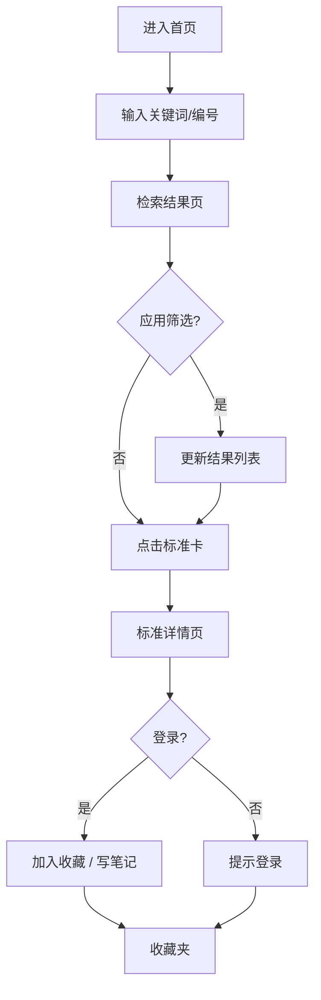

# 试验标准查询 App — 产品需求文档 (PRD)

## 1. 产品概述
「试验标准库 Standardum」是一款面向工程师、检测人员与科研工作者的试验标准检索 Web 应用，覆盖材料、机械、环境、电子、建筑、化工六大领域的中外标准（GB / ISO / ASTM / IEC / JIS / DIN 等）。用户可以通过编号、关键词、领域、状态快速定位标准，查看适用范围、试验条件、版本沿革等关键信息，并支持本地收藏与历史检索。
- 目标用户：质量工程师、第三方检测机构、制造业研发人员、高校实验室
- 价值：把分散的纸质/在线标准资料整合为可即时检索、可对比、可收藏的结构化档案

## 2. 核心功能

### 2.1 用户角色
| 角色 | 注册方式 | 核心权限 |
|------|----------|----------|
| 访客 | 无需注册 | 浏览/检索全部标准、查看详情 |
| 注册用户 | 本地账号 | 收藏标准、查看历史、添加批注 |

### 2.2 功能模块
1. **首页 / 检索台**：搜索框、热门领域标签、最新发布、最近访问
2. **检索结果页**：筛选侧栏（领域/标准类型/状态/年份）、结果列表、排序
3. **标准详情页**：标准元信息卡、适用范围、试验条件、版本沿革、关联标准
4. **收藏夹**：本地持久化收藏的列表、笔记
5. **关于 / 帮助**：项目说明、字段释义

### 2.3 页面详情
| 页面 | 模块 | 描述 |
|------|------|------|
| 首页 | Hero 检索台 | 居中检索框、领域分类芯片、底部分享统计 |
| 首页 | 数据看板 | 收录数量、覆盖国家、今日新增 |
| 检索结果 | 筛选侧栏 | 复选 + 滑块组合 |
| 检索结果 | 列表卡片 | 编号 / 名称（双语）/ 状态徽章 / 摘要 |
| 标准详情 | 信息卡 | 编号、英文名、状态、发布日期、实施日期、主管部门 |
| 标准详情 | 标签页 | 适用范围、试验条件、引用文件、版本沿革 |
| 标准详情 | 关联 | 引用 / 被引标准跳转 |
| 收藏夹 | 列表 | 卡片视图、笔记折叠、移除按钮 |

## 3. 核心流程
访客通过首页输入「标准编号或关键词」→ 进入检索结果页 → 可二次筛选 → 点击进入详情 → 必要时加入收藏。注册用户登录后可在收藏夹查看所有已收集的标准。

## 4. 用户界面设计

### 4.1 设计风格
- **主题方向**：Technical Editorial — 工程档案 × 杂志编辑风格的混搭，营造「权威工具书」的视觉调性
- **主色**：墨蓝 `#0F1B2D`（主背景）、纸米 `#F2EDE2`（次背景）、黑墨 `#11151C`（正文）
- **强调色**：赤铜 `#C45A2A`（CTA / 状态-现行）、苔绿 `#5C7A4F`（状态-推荐）、琥珀 `#B8862E`（状态-即将实施）、灰青 `#6E7A86`（状态-废止）
- **字体**：
  - 标题：`Fraunces`（衬线，强对比，体现档案感）
  - 正文：`Inter`（无衬线，清晰易读）
  - 编号 / 数据：`JetBrains Mono`（等宽，强化技术感）
- **按钮 / 卡片**：直角微圆角（4px），实色 + 1px 边框；hover 出现 0 4px 0 的硬阴影（"凸版印刷"质感）
- **布局**：12 列栅格；首页采用非对称 editorial layout（左侧大字检索 + 右侧侧栏数据卡）
- **图标**：lucide-react，统一 1.5px 描边

### 4.2 页面设计概述
| 页面 | 模块 | UI 元素 |
|------|------|----------|
| 首页 | Hero | 60vh 巨幅标题 "Standards, indexed." + 命令行式检索框 + 6 领域芯片 |
| 首页 | 数据看板 | 等宽数字 + 横向延展刻度线 |
| 检索结果 | 工具栏 | 排序下拉、视图切换（列表 / 网格）、结果计数 |
| 检索结果 | 列表卡 | 左侧编号（Mono 字体竖排）+ 右侧标题与摘要 + 状态徽章 |
| 标准详情 | 头部 | 编号、超大衬线标题、双语副标题、状态徽章组 |
| 标准详情 | 标签页 | 顶部下划线 tab、内容为段落 + 列表混排 |
| 标准详情 | 元信息 | 三列键值对，等宽标签 + 衬线值 |
| 收藏夹 | 列表 | 卡片式 + 拖拽排序，附批注输入框 |

### 4.3 响应式
Desktop-first（1280px+ 设计基准），向下兼容 1024 / 768 / 375。Mobile 下检索框与筛选器折叠为底部抽屉；详情页标签页转为顶部 chip 切换。

### 4.4 3D 场景指导
不涉及 3D。

## 5. 数据范围（MVP 内置 Mock）
- ≥ 60 条标准数据，跨 6 大领域，每条包含：编号、中英文名称、状态、发布日期、实施日期、主管部门、适用范围、试验条件、关键词
- 至少 10 个国家/组织前缀（GB / ISO / ASTM / IEC / JIS / DIN / BS / EN / NF / GJB）
- 通过 zustand 持久化收藏与历史
