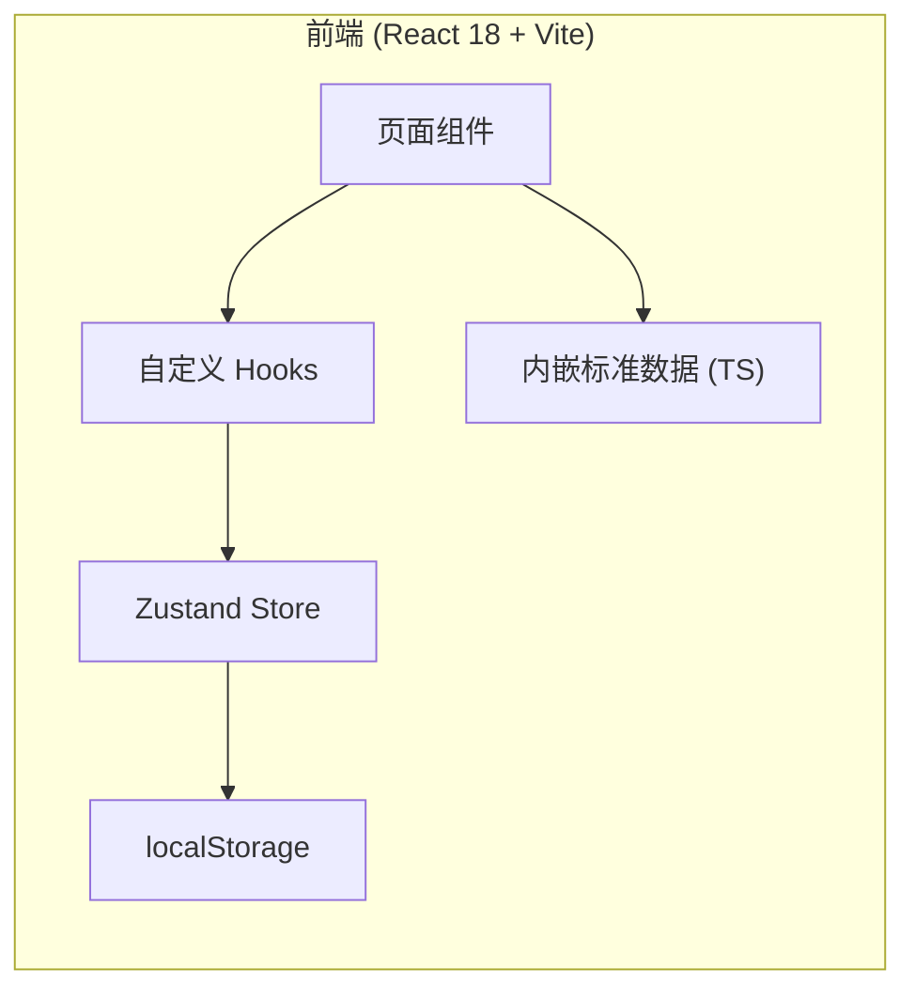
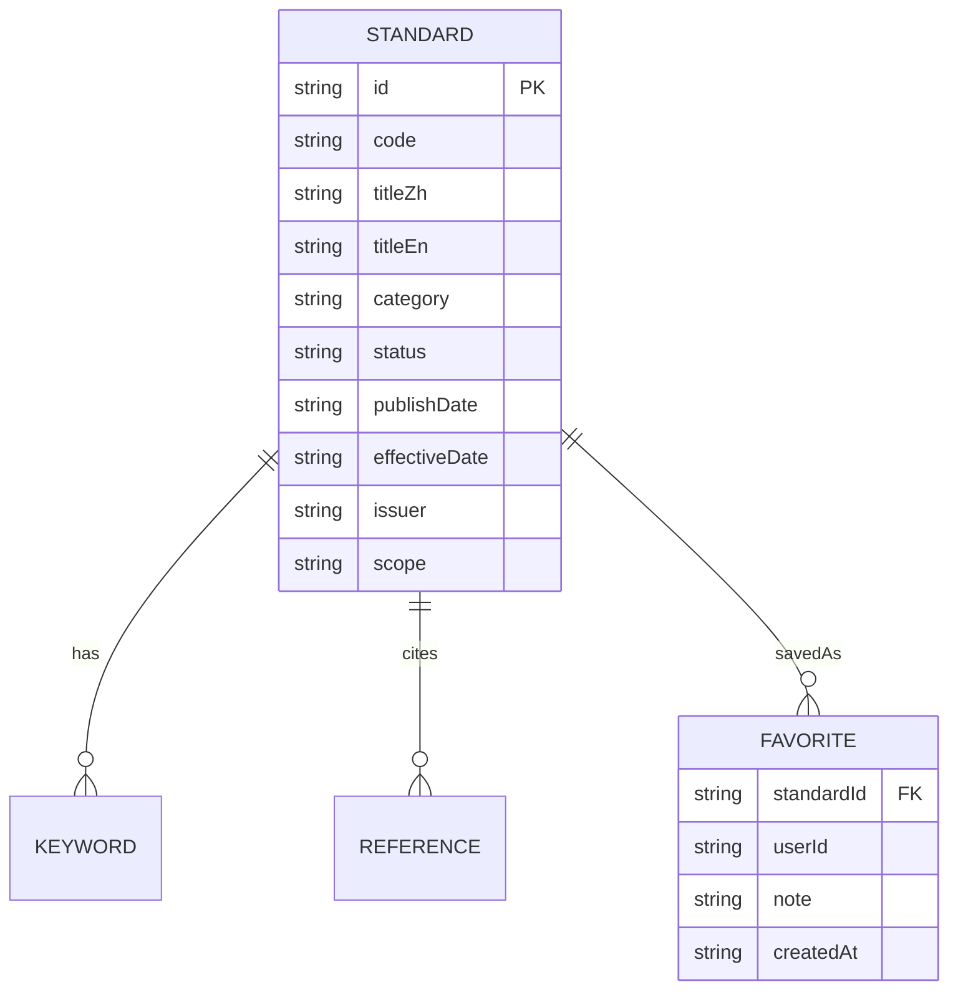

# 试验标准查询 App — 技术架构文档

## 1. 架构设计
纯前端单页应用，状态通过 zustand + localStorage 持久化，所有标准数据以 JSON 形式内嵌。路由由 react-router-dom 提供，搜索/筛选在前端完成。



## 2. 技术说明
- 前端：React 18 + TypeScript + Vite
- 样式：TailwindCSS 3（自定义 design tokens：墨蓝、纸米、赤铜等）
- 路由：react-router-dom v6
- 状态管理：zustand（含 persist 中间件）
- 图标：lucide-react
- 字体：Google Fonts（Fraunces / Inter / JetBrains Mono）通过 index.html 注入
- 数据：内置 `src/data/standards.ts`，≥ 60 条
- 后端：无（MVP 阶段全部 mock）

## 3. 路由定义
| 路径 | 用途 |
|------|------|
| `/` | 首页 / 检索台 |
| `/search` | 检索结果页（query string 同步） |
| `/standard/:id` | 标准详情页 |
| `/favorites` | 收藏夹 |
| `/about` | 关于页面 |

## 4. API 定义
本阶段无后端 API；后续如接入标准数据库：
```ts
type Standard = {
  id: string;
  code: string;        // 编号
  titleZh: string;
  titleEn: string;
  category: Category;
  status: 'active' | 'recommended' | 'pending' | 'withdrawn';
  publishDate: string;     // ISO date
  effectiveDate: string;
  issuer: string;
  scope: string;
  testConditions: string[];
  keywords: string[];
  references: string[];     // 引用的其他标准编号
  supersedes?: string;      // 替代旧版本编号
};
```

## 5. 服务端架构
无后端。

## 6. 数据模型

### 6.1 ER 图


### 6.2 Mock 数据初始化
- `src/data/standards.ts` 导出 `STANDARDS: Standard[]`，开发期通过脚本/手工补充至 ≥ 60 条
- `src/store/useAppStore.ts` 定义 `favorites`、`history` 两个 slice
